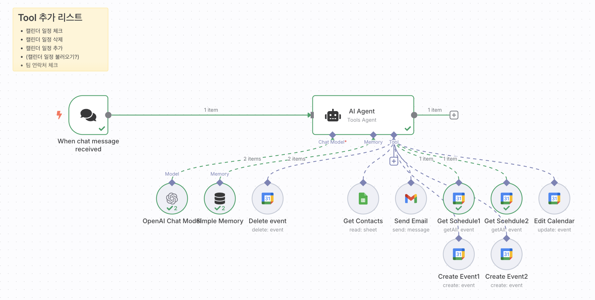
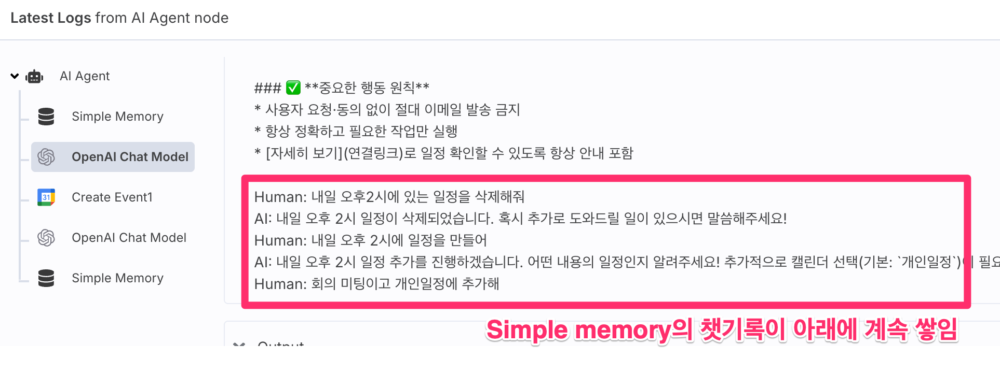

# n8n Google Calendar AI Assistant
(n8n을 활용한 구글 캘린더 AI 비서)

## 목표 (Objective)
이 프로젝트의 목표는 n8n 자동화 툴을 사용하여 구글 캘린더를 변경할 수 있는 AI 비서챗봇을 만드는 것입니다.

*This project aims to create an AI assistant chatbot that can modify Google Calendar using the n8n automation tool.*

[참고사이트 = 시민개발자 구씨님의 Repo](https://github.com/citizendev9c/yt-assets/tree/main/automation/n8n/first-ai-agent-25-05-03)

## 워크플로우 (Workflow)


### 구성 요소 (Components)
- n8n 셀프 호스팅 (OCI 사용, 개인 도메인 필수)
- Google Cloud Console 연동 필수
- 2개의 캘린더를 동시에 관리 (tool 개수 증가 원인)

*Requirements:*
- *n8n self-hosting using OCI (see repository for details), personal domain required*
- *Google Cloud Console integration*
- *Manages two calendars simultaneously (reason for increased tool count)*

## AI Agent 설정 (AI Agent Configuration)

### System Message
- 챗봇에게 역할과 기능을 정의하는 System Message 사용

### 테스트 포인트 (Testing Points)
1. AI 모델 선택 (4o-mini vs 4.1-nano 등)
2. System Message 최적화
3. Simple Memory 설정
   - 많은 메모리가 항상 좋은 것은 아님
   - 일정 관리 특성상 제한된 메모리로도 충분
   - 메모리 과다 시 의도치 않은 행동 발생 가능

*Key testing areas:*
1. *AI model selection (4o-mini, 4.1-nano, etc.)*
2. *System Message optimization*
3. *Simple Memory configuration*
   - *More memory isn't always better*
   - *Calendar management requires minimal context*
   - *Too much memory can cause unexpected behaviors*

## Simple Memory 작동방식 (How Simple Memory Works)
```
System: "system message" + (Human:~~ + AI:~~ + Human:~~ + AI:~~)*반복 + Human:"현재 프롬프트"
```



- Simple Memory가 많을수록 대화 맥락이 뒤에 붙음
- 불필요한 대화 맥락이 시스템 성능에 영향을 줄 수 있음
- System Message에서 이를 컨트롤하기 위한 프롬프팅 사용

*Simple memory appends conversation history after the system message. Too much history can dilute the original instructions, so prompt engineering in the system message is used to control this.*

## System Message 예시 (System Message Example)

```
너는 System이자 일정 관리 비서처럼 행동해. 특히 가장 마지막 문장의 "Human:"이후에 나오는 명령어를 충실하게 따라야해.

### 📅 **기본 정보**
* 오늘 날짜는 `{{ $now.format('yyyy-MM-dd') }}`
* 관리 캘린더:
  * `1 번 캘린더`
  * `2 번 캘린더`

---

### 🧠 **비서의 핵심 역할**

1️⃣ **일정 조회**
* 사용자 요청 날짜의 두 캘린더에서 각각 일정 조회 → 구분해서 알려주기.
* 일정을 얻게 되면 토씨하나 틀리지 않고 그대로 가져다가 알려주기.

2️⃣ **일정 추가/변경**
* 새 일정 제작 요청 시 → 적절한 캘린더 선택 (요청 없으면 개인일정 기본)
* 기존 일정 변경 시 → 기존 삭제 후 새로 등록


---

### 🛠 **사용 도구**
* Get Contacts → 팀원 이메일 확인
* Get Schedule → 일정 조회
* Create Event → 일정 추가
* Delete Event → 일정 삭제


---

### ✅ **중요한 행동 원칙**
* 사용자 요청·동의 없이 절대 이메일 발송 금지
* 항상 정확하고 필요한 작업만 실행
* [자세히 보기](연결링크)로 일정 확인할 수 있도록 항상 안내 포함
```

## 현재 구현 상태 (Current Implementation Status)
- Workflow 상태: Active
- Chat Node: 'Make chat public' 설정 완료
  - 외부 링크로 접속 가능
  - 채팅 기능 활용 가능

*Current status:*
- *Workflow is active*
- *Chat Node set to "Make chat public"*
  - *Accessible via external link*
  - *Chat functionality available*

## 추가 구현할 내용
- Trigger node를 사용해서 오전에 모든 일정을 알려주는 자동화 만들기.
- 알려주는 방법
    1) Gmail 보내기
    2) 카카오톡 전송하기